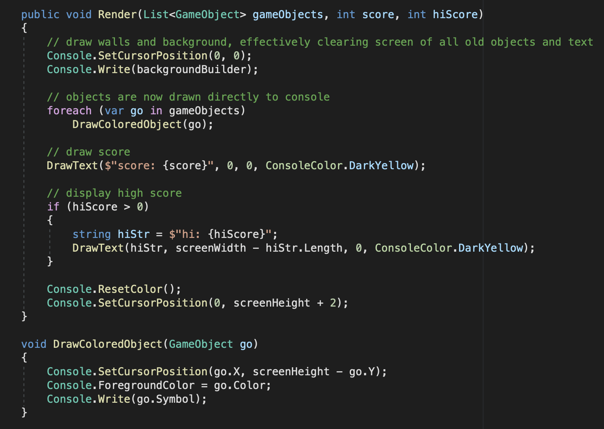

# Galaxy

An educational C# project that simulates a simple console game where you control a ship and defend against incoming enemies.

The project is structured as a sequence of lessons, each extending the previous one and gradually increasing in complexity.

## Demo

## Code Example

**Purpose:**
- Helps beginners learn C# through practical, step-by-step development of a simple game  
- Builds a solid understanding of programming fundamentals and object-oriented principles  
- Introduces fundamental game development concepts with a focus on logic, structure, and game loops  
- Provides a foundation for further learning in game development, including Unity 

**Controls:**
- **Left / Right arrows** — move the ship
- **Up arrow** — shoot
- **Esc** — exit the project

**Game:**
- The game updates the frame after each player action
- The game is turn-based rather than real-time
- In later lessons, enemies shoot, and bullets move independently
- Score increases by destroying enemies, with higher rewards for shooting enemies

**Lessons:**
- 10 lessons in total. Each lesson gradually increases in difficulty and expands on the previous one
- Each lesson introduces a separate `Game` class with a `Run()` method
- Comments in the code describe only the new elements introduced in the current lesson
- Lessons progressively cover:
  - Basic console output and input
  - Loops and arrays
  - Methods and enums
  - Lists and dynamic collections
  - Object-oriented programming
  - Game architecture and refactoring
  - Rendering techniques
  - Handling multiple objects (player, enemies, bullets)
  - Enemy movement and shooting logic
  - High score management using file storage

**Notes:**
- Graphics are simple, text-based symbols  
- The focus is on **understanding C# and game development concepts**, not creating a polished game  
- Each lesson introduces only the new features for that lesson, making it easier to follow and understand  

## Requirements 
- Visual Studio 
- Windows / macOS / Linux

## How to Run:
1. Open the solution in Visual Studio.
2. In `Program.cs`, set the lesson number you want to run (choose 1–10)
3. To study the implementation of a specific lesson, open the corresponding Lesson_N.cs file in the root project folder (Galaxy).
4. Press F5 to run.

**Other**

- If you find this project useful, a ⭐ would mean a lot.
- Contributions are welcome — see CONTRIBUTORS.md.